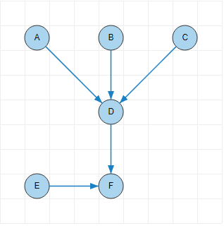

# SimpleDiagram.js

**SimpleDiagram.js** is a small JavaScript library for creating simple diagrams with nodes and links.
There is nothing fancy going on here; no complex algorithms for positioning are included.
You'll need to supply all the positions of the nodes yourself. This lets you craft
a diagram to be laid out exactly the way you want, but at the cost of more work on your part
as you'll need to determine the coordinates of every node and any other shapes you want to add to
your diagram.

**Dependencies**:
[D3.js](http://d3js.org/)

Specifically, the following standalone packages (and their dependencies) are needed:
- d3-selection
- d3-transition

### [Full Documentation](docs.md)

## Example

The code below shows how to create a simple diagram.


```javascript
var diagram = new SimpleDiagram('#diagram', {
    addGrid: true,
    cellSize: 35,
    numColumns: 9,
    numRows: 9,
    interactive: false
});

var nodes = [
    {name: 'A', row: 2, column: 2, connectsTo: 'D'},
    {name: 'B', row: 2, column: 5, connectsTo: 'D'},
    {name: 'C', row: 2, column: 8, connectsTo: 'D'},
    {name: 'D', row: 5, column: 5, connectsTo: 'F'},
    {name: 'E', row: 8, column: 2, connectsTo: 'F'},
    {name: 'F', row: 8, column: 5}
];

// Draw the nodes!
nodes.forEach(function(node) {
    diagram.addNode({
        name: node.name,
        label: node.name,
        shape: 'circle',
        row: node.row,
        column: node.column
    });
});

// Draw the links!
nodes.forEach(function(node) {
    if (!node.connectsTo)
        return;

    diagram.addLine({
        from: node.name,
        to: node.connectsTo
    });
});
```

In browsers that support SVG, this gives a diagram that looks like this:


